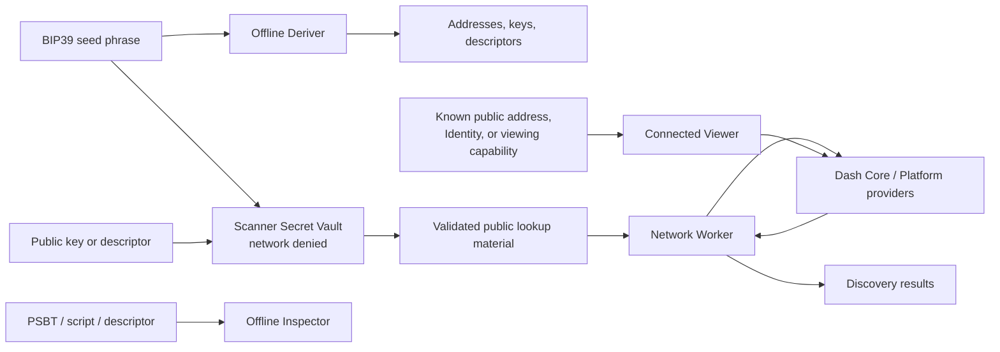

# How Dash support works

This page explains the Dash model used by Multi-Chain Wallet Tools. It is meant for users and technically interested reviewers who want to understand the design before reading protocol-level details.

Dash support is not one address format or one balance lookup. The project treats four different resource models separately because they use different derivation rules, identifiers, units, privacy properties, and network sources.

| Dash area | What the wallet holds | What the tools show |
| --- | --- | --- |
| **Core** | Ordinary Layer 1 keys and UTXOs | Receive/change addresses, balances, and confirmed address history |
| **Platform Payments** | Platform payment keys and credit balances | DIP17-derived keys, DIP18 addresses, current proof-verified state, and indexed history where available |
| **Identity** | Keys registered to a Platform Identity | Candidate registration keys or proof-verified registered Identity state and key roles |
| **Orchard** | Shielded notes and viewing/spending capabilities | Shielded addresses, viewing material, or locally recovered note activity |

Amounts are kept in their native units. Dash Core uses duffs. Dash Platform and Orchard use Platform credits where the protocol defines them. The interface labels these units explicitly rather than treating them as interchangeable.

## The four Dash models

### Dash Core

Dash Core is the ordinary Layer 1 UTXO chain. Standard recovery uses BIP44 receive and change branches. The tools also expose documented Dash wallet families such as legacy mobile paths, Mobile CoinJoin DIP9, provider holdings, and Purpose48 legacy multisig where the selected workflow supports them.

A Core public address is enough to view that address. An account public key or descriptor can derive its reachable public address branches. A seed phrase can search all supported Core families and accounts selected by the user.

### Platform Payments

Platform Payments use hardened DIP17 account and key-class levels, followed by a non-hardened address index. DIP18 converts the compressed public-key hash into the displayed `dash1…` or test-network `tdash1…` Platform address.

The receive key class and internal/change-like key class are separate paths. This resembles receive/change organization in the interface, but it is a Platform key class rather than a BIP44 change level. Current state comes from proof-verified Platform DAPI; compatible indexed services may add historical context.

### Platform Identity

A Platform Identity is created by a state transition and has its own Identity ID. That ID is not derived directly from a seed phrase. The seed derives candidate keys that a wallet may register to an Identity.

The Deriver shows the current official wallet's default four-key registration profile as candidate material. The Viewer obtains actual registered roles, security levels, balance, revision, nonce, and names from proof-verified Platform state. The Scanner uses a derived public-key fingerprint to look for an Identity that has already been registered. It does not invent an Identity ID or claim that an unused candidate exists on Platform.

### Orchard

Dash Orchard is a shielded pool. Its ZIP32 account derivation, key types, addresses, encrypted notes, and nullifiers differ from Core and Platform payment addresses.

A spending key controls funds. A full viewing key can reveal incoming and outgoing wallet activity without spending. Incoming or outgoing viewing keys provide narrower visibility. These viewing capabilities are privacy-sensitive even though they cannot spend funds.

The tools use the pinned official Dash Orchard Rust implementation compiled to browser WASM. Network services return proof-verified encrypted pool data; viewing keys remain local while the WASM scanner attempts note recovery and matches owned-note nullifiers.

## What each tool does

| Tool | Dash role | Network access |
| --- | --- | --- |
| **Wallet Key Derivation Tool** | Derives Core, Platform Payment, Identity candidate, and Orchard key/address material | Blocked by CSP |
| **Wallet Activity Viewer** | Views a supplied Core address, Platform address, Identity record, or Orchard viewing capability | Required for public state/history |
| **Wallet Discovery Scanner** | Searches selected Dash families from BIP39 candidates or reachable watch-only material | Required in outer shell; secrets stay in a network-denied vault |
| **PSBT & Multisig Inspector** | Reviews supported Dash Core PSBT/script/descriptor data and constructs test P2SH watch-only policies | Blocked by CSP |

The tools have different purposes. The Deriver produces local key material. The Viewer answers “what happened to this known public resource?” The Scanner answers “which supported wallet resources belong to this seed or watch-only account?” The Inspector reviews transaction and policy structure before a separate wallet signs anything.

## Data flow and trust boundaries

The Scanner's vault boundary prevents seed phrases, private keys, and registered Orchard viewing-key state from becoming arbitrary network request data. Only fixed, typed public lookup operations cross to the Network Worker. This reduces accidental secret exposure; it does not make an already compromised browser or operating system trustworthy.

## Safe input choices

- Use the **Deriver offline** for a real seed phrase or private key.
- Use the **Viewer** only with public addresses, public Identity data, or an Orchard viewing capability whose privacy exposure you accept.
- Use the **Scanner public-key tab** when its limited account/branch coverage is enough.
- Use the **Scanner seed tab** for the broadest supported recovery search, preferably on a trusted computer and network.
- Treat a private account descriptor, Orchard viewing key, and exported recovery report according to the sensitive information each contains.

A public key cannot cross hardened derivation levels. One account key therefore cannot search unrelated Bitcoin address types, another Dash account, or another hardened Dash family. The Scanner asks for a coin when the extended-key encoding is shared and the coin cannot be determined safely.

## What the suite does not do

The tools do not create, sign, prove, or broadcast recovery transactions. They do not guarantee that every wallet application or nonstandard path has been searched. Native Electrum seed phrases are outside the BIP39 input model. The Inspector does not establish that a policy is suitable for real funds merely because it can parse or construct it.

Restore and move valuable funds with a maintained standard wallet after independently confirming the reported address, path, network, and amount.

## Detailed references

For exact derivation paths, byte encodings, HRPs, upstream commits, proof and provider behavior, Orchard wire layout, fixtures, limits, and upgrade rules, read the [Dash implementation and verification reference](reference/DASH_IMPLEMENTATION.md).

Related documents:

- [Security model and known limitations](../SECURITY_AUDIT.md)
- [Architecture and package boundaries](ARCHITECTURE.md)
- [Verification map](VERIFICATION.md)
- [Account descriptor import guide](ACCOUNT_DESCRIPTORS.md)
- [Current roadmap](ROADMAP.md)
